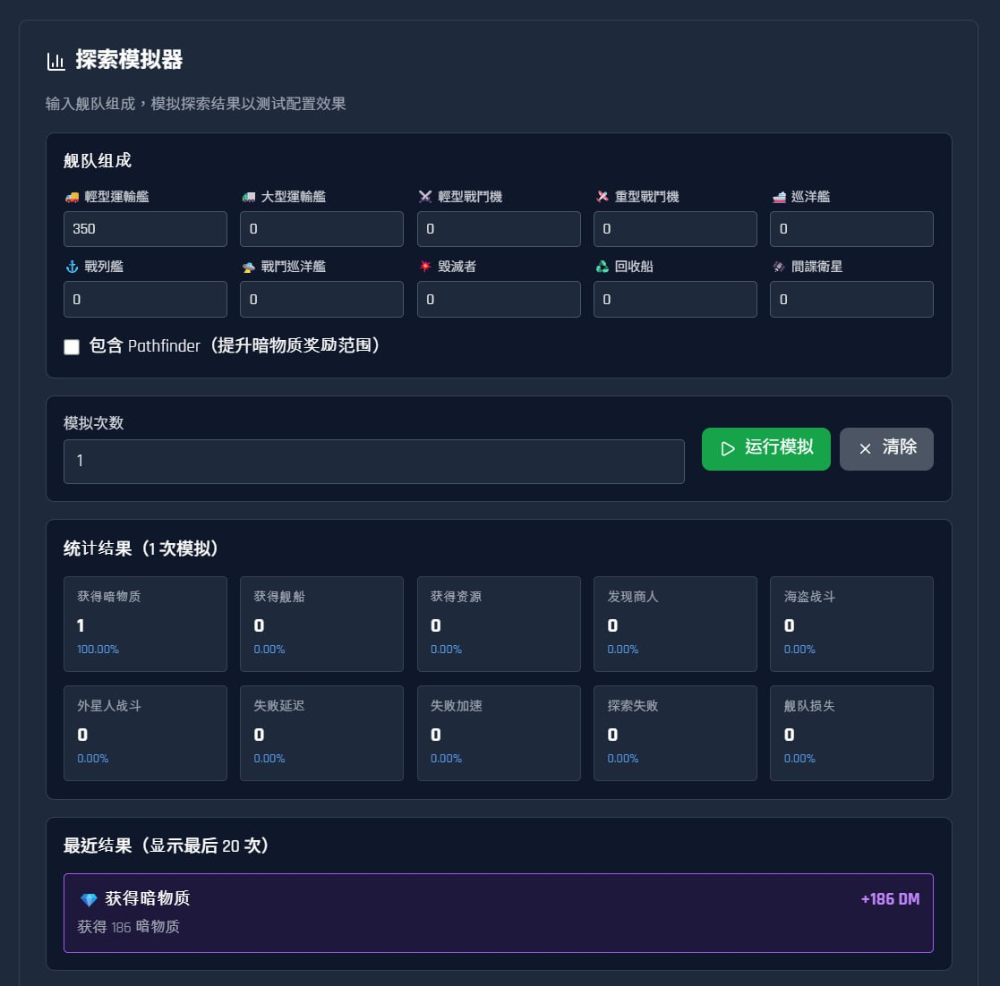
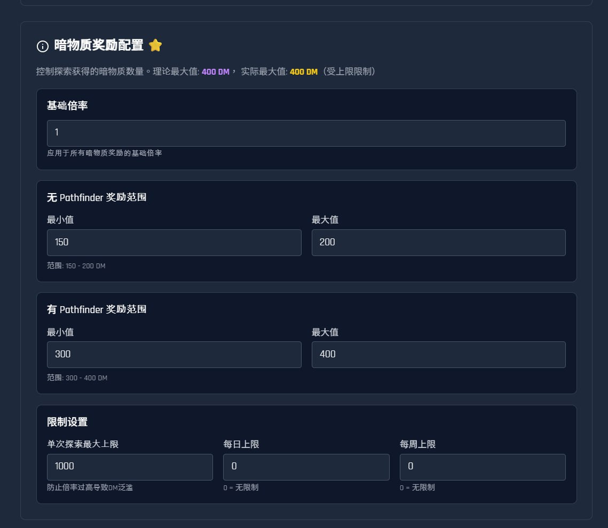
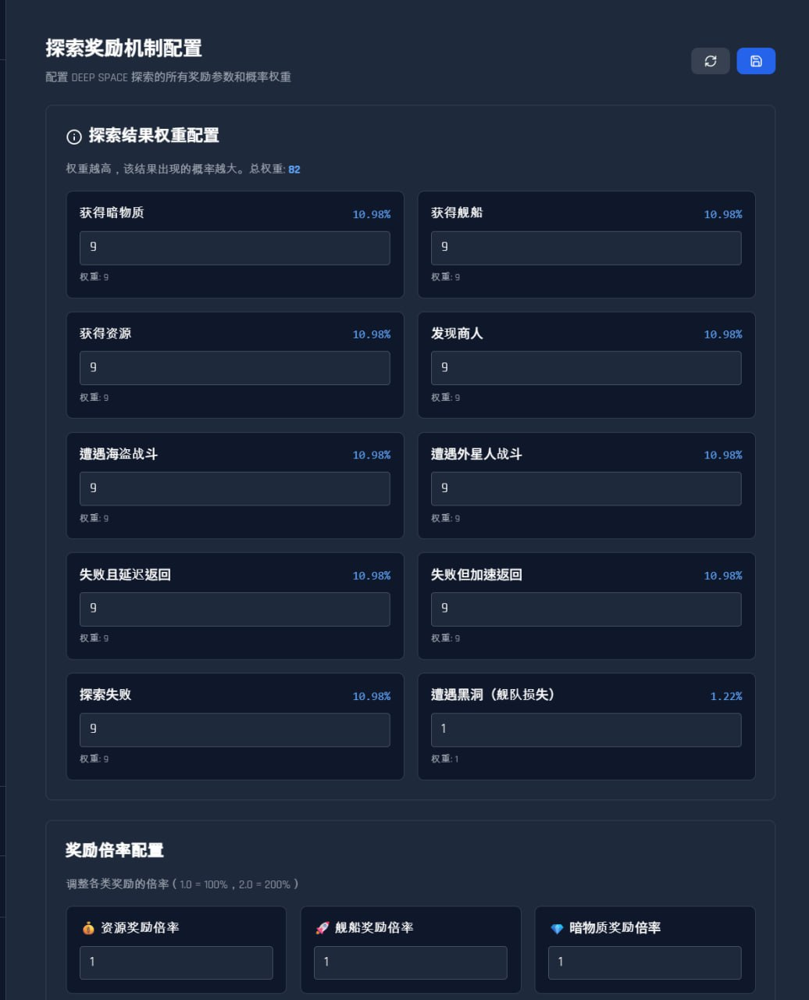

# CSpaceX - Interstellar Conquest Strategy Game

## Demo Links

🎬 [Demo Video](https://drive.google.com/file/d/1R4m31sF9rWKvio9qUbwlq72xRrKpysL1/view)

---

## Project Introduction

**CSpaceX** is a multiplayer online space strategy game where you start with a single planet and gradually build and manage your space empire.

### From One Planet to Galactic Dominance

At the start of the game, you own one planet as your base. You need to build metal mines, crystal mines, and deuterium synthesizers to gather resources, which are the foundation of development. As resources accumulate, you can upgrade buildings, research technologies, and build fleets. Each planet is an independent production base, and you can colonize more planets to expand your empire.

### Strategy and Wisdom Combined

The game is not just about building and collecting. You need to plan resource allocation, decide which technologies to prioritize, when to build fleets, and how to defend against enemies. The combat system tests your strategy—different warships have different characteristics and need to be properly combined to win. The expedition system brings unknown rewards and risks, and each exploration could change your fate.

### Interact with Players, Form Alliances

You can trade resources with other players, form alliances for joint operations, and compete for dominance in the galaxy. Alliance members can support each other and coordinate operations, making the game more social.

### Advanced Technology, Smooth Experience

The game is built with modern technology, featuring a smooth interface and simple operations. 3D visualization technology lets you see your planets and fleets intuitively. The system updates your resource production and construction progress in real-time, and the game continues to develop even when you're offline. All important operations have complete records, ensuring fairness and transparency.

### Continuous Development, Infinite Possibilities

The game world continues to operate, and your empire will keep growing. Every decision affects your development speed, and every battle could change the landscape. From one planet to galactic dominance, every step requires wisdom and strategy. Join CSpaceX, begin your interstellar journey, and write your legend in the vast universe!

---

## Core Features

### 1. Resource Building System

Players can build and manage various resource production buildings, including metal mines, crystal mines, and deuterium synthesizers. Through strategic resource management, players can achieve sustainable development of their colonies.

---

### 2. Technology Tree System

A complete technology research system with multiple research branches including weapon technology, energy technology, and propulsion systems. Players need to develop long-term strategies and allocate research resources wisely to unlock more powerful technologies.

---

### 3. Fleet Combat System

Players can build various ships and defense systems to engage in strategic combat across the galaxy. Through fleet configuration and tactical deployment, players can conquer other planets or defend their own colonies.

---

### 4. Deep Space Exploration and Planet Colonization System

Players can explore the vast universe, discover new planets, and establish colonies. Each planet has unique resources and strategic value, requiring players to develop expansion strategies.

---

### 5. Dark Matter System

Dark matter is the premium currency in the game, purchasable through Canton Coin (CC). Dark matter can be used for officer promotions, construction acceleration, and other premium features, making it an important component of the game's economic system.

---

<<<<<<< HEAD
### 6. Admin Management System

The powerful admin management system supports value simulation and configuration. Administrators can adjust game parameters, resource production rates, building costs, and other core values to ensure game balance and stable operation of the economic system.

Administrators can precisely control the allocation and distribution of dark matter, including event rewards and mission completion rewards. The system supports batch operations and automated allocation rules, ensuring fairness and transparency in the game economy.

A comprehensive reward mechanism management system that supports multiple reward type configurations, including resource rewards, dark matter rewards, and special items. Administrators can set event rewards, daily mission rewards, milestone rewards, and more, flexibly controlling in-game economic flows.

---

## Expected Value

- **Stable Transaction Volume**: 20-50 on-chain transactions per user per day
- **Long-term User Retention**: Strategy game features drive continuous engagement
- **Innovative Application Case**: Blockchain game application demonstration
- **Active Community Ecosystem**: Strategy game player community

---

## Why Choose Us

**CSpaceX** is not just a game, but a technology-driven operations platform that demonstrates comprehensive control over the game ecosystem.

### Powerful Admin Management System

We have a fully functional admin management system that allows the operations team to fully control the game. The system is divided into four major modules: user management, game configuration, transaction monitoring, and data management. Administrators can view all player data, adjust resource allocation, and manage alliance relationships. Most importantly, the game configuration system allows administrators to adjust game parameters in real-time, including building costs, research times, and combat rules, without restarting the server, enabling rapid response to market changes and game experience optimization.

### Canton Network - Enterprise-Grade Blockchain Foundation

We chose Canton Network as the underlying technology, a blockchain platform designed for enterprise applications. It has high-performance processing capabilities, maintaining smooth operation even with many players online simultaneously. More importantly, Canton Network provides strong privacy protection mechanisms, ensuring player data security while meeting regulatory compliance requirements. This provides a stable, reliable, and scalable technical foundation for the game.

### DAML Technology - Transparent and Trustworthy Recording System

We have integrated DAML technology to record all important game events on a distributed ledger. Every player action in the game, including building upgrades, resource transactions, and combat results, is permanently recorded and cannot be tampered with. This not only enhances player trust in the game but also provides complete audit trail capabilities for game operations. When disputes arise, they can be quickly verified, ensuring fairness and justice.

### Highly Complete System Architecture

The entire system architecture is complete, with every aspect carefully designed from frontend interface to backend services, from database management to blockchain recording. The system supports real-time data synchronization, with player actions taking effect immediately. The automatic resource production system keeps the game running continuously, and the game continues to develop even when players are offline. Complete activity logs record all operations, ensuring traceability. The modular design makes the system easy to maintain and expand, providing a solid foundation for long-term game operations.

### Demonstrating Technical Control

This system demonstrates our comprehensive control over game technology. We can not only develop games but also operate them, quickly responding to market changes through technical means, optimizing player experience, and ensuring game fairness and transparency. Whether for daily operations or handling emergencies, we have complete technical solutions. This technical capability is key to successful game operations and our core competitive advantage that distinguishes us from other games.

---

*CSpaceX - Next-Generation Web-Based Space Strategy Game Platform*
=======
*CSPaceX - 下一代网页宇宙策略游戏平台*
>>>>>>> af6a596c331091ea3e3d5fef4ed4d9f3fd8f1f58

