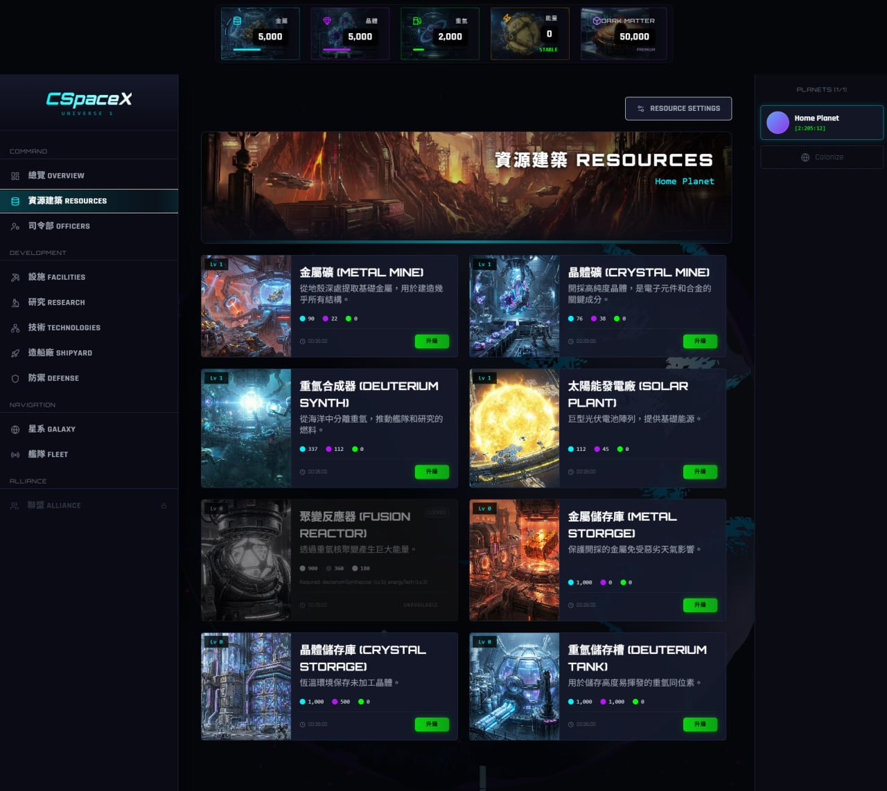
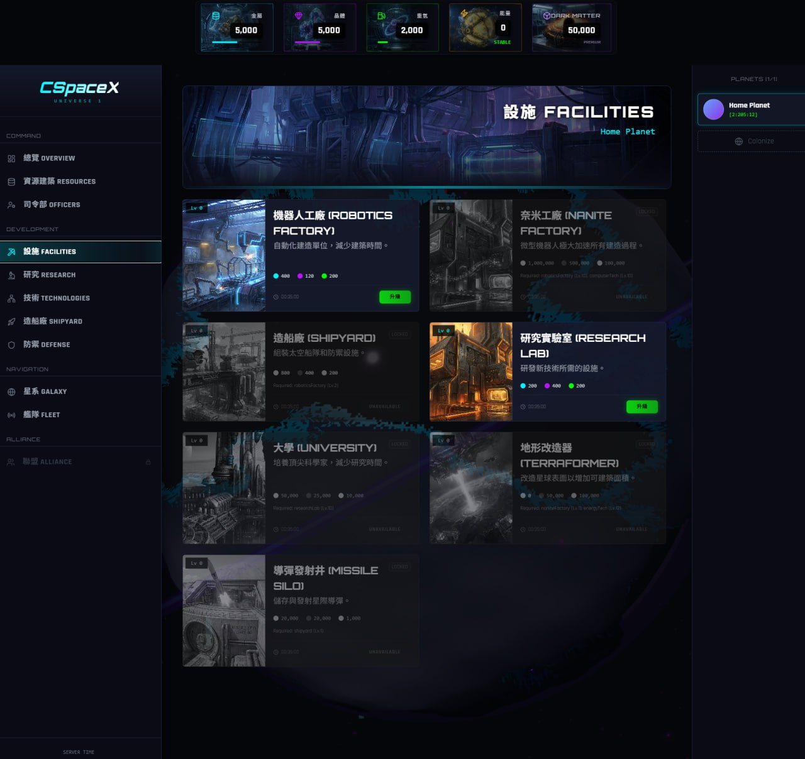
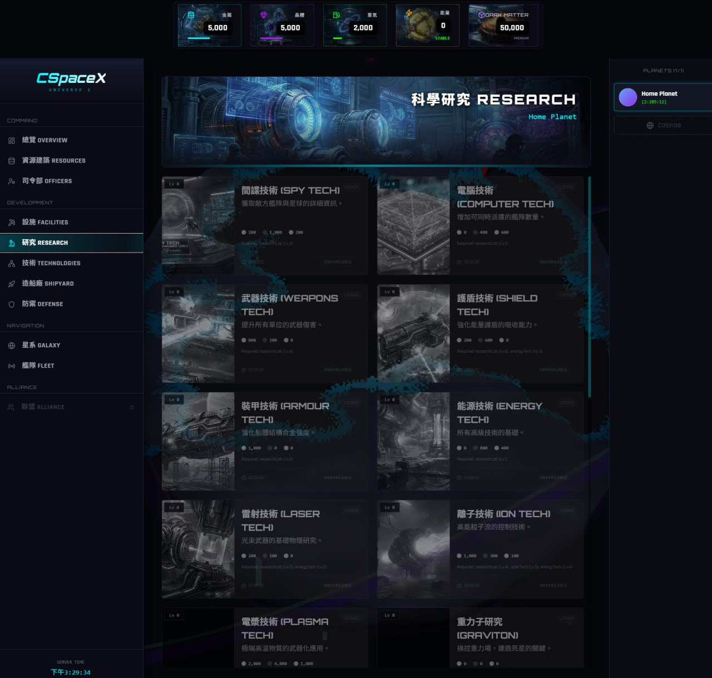
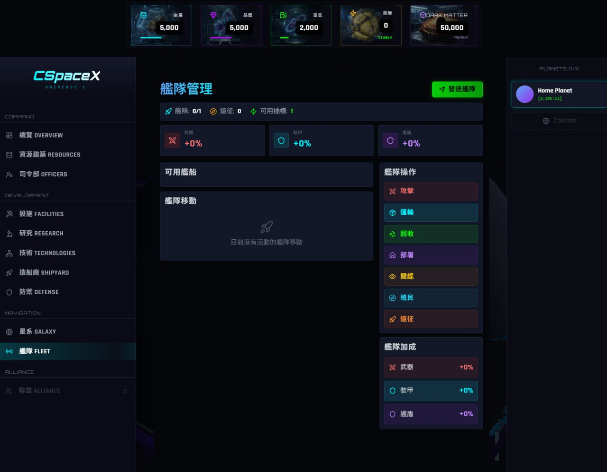
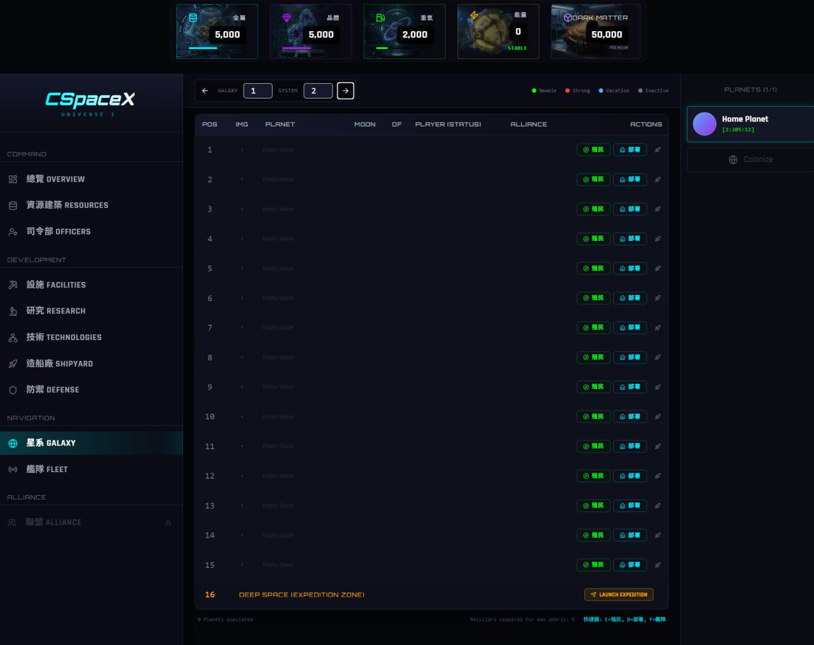
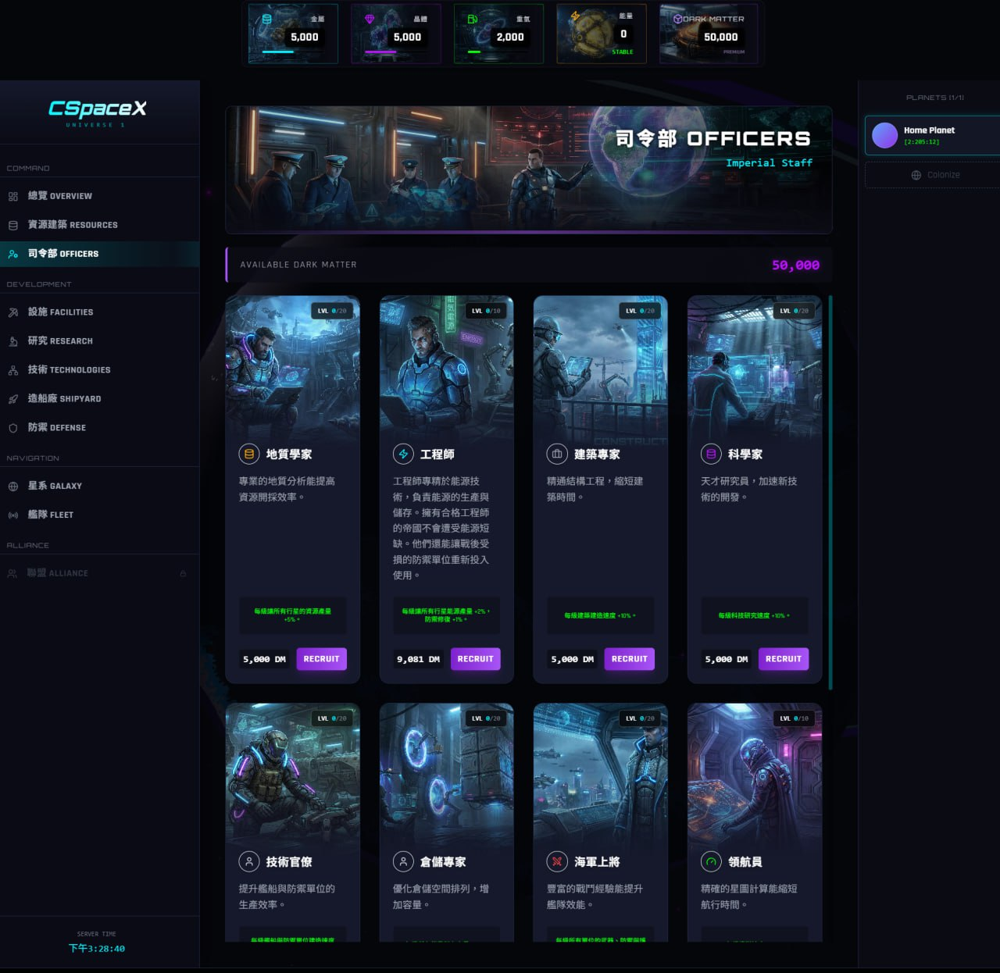

# SPaceX - 网页宇宙策略游戏

## 项目简介

**SPaceX** 是一款基于 WebGL 3D 的网页宇宙策略游戏平台，结合 AI 策略顾问与区块链经济系统。所有游戏内经济活动均记录在 Canton Network 上，确保透明与可验证。

---

## 核心功能展示

### 1. 建造资源系统

玩家可以建造和管理各种资源生产建筑，包括金属矿、晶体矿、重氢合成器等。通过合理的资源管理策略，实现殖民地的可持续发展。

---

### 2. 科技树系统

完整的科技研究系统，包括武器技术、能源技术、推进系统等多个研究分支。玩家需要制定长期策略，合理分配研究资源，解锁更强大的科技。

---

### 3. 舰队战斗系统

玩家可以建造各种舰船和防御系统，在银河系中进行战略战斗。通过舰队配置和战术运用，征服其他星球或防御自己的殖民地。

---

### 4. 探索深空、殖民星球系统

玩家可以探索广阔的宇宙，发现新的星球并进行殖民。每个星球都有独特的资源和战略价值，需要玩家制定扩张策略。

---

### 5. 暗物质系统

暗物质是游戏中的高级货币，可通过 Canton Coin (CC) 购买。暗物质可用于军官晋升、加速建造等高级功能，是游戏经济系统的重要组成部分。

---

## 预期价值

- **稳定的交易流量**：每用户每日 20-50 笔链上交易
- **长期用户留存**：策略游戏特性带来持续参与
- **创新应用案例**：区块链游戏应用示范
- **活跃社区生态**：策略游戏玩家社区

---

*SPaceX - 下一代网页宇宙策略游戏平台*

